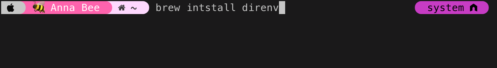
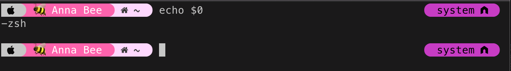

# Hello Development
This document will walk you through the steps required to get set up with all of the basic tools that will be used throughout each of the "lessons" within this repo. 

***NOTE:*** *There are many different tools used by developers and they all have their own advantages and disadvantages. The setup provided in this document is meant to be a starting point that individuals learning to program can use throughout their learning process. This is not meant to serve as an exhaustive list of all tools that are available or meant to be an example of the "ideal environment setup" it simply is a setup to get individuals up and running.*

## Getting the tools you need:

### Iterm: 
Iterm is a replacement for the default terminal on MacOS. It is not required, I just find it to be nicer to use than the default

download iterm at the following link: https://iterm2.com/

### VScode 
VScode is an editor used for writing code. There ar other options out there. VS code is a free and relatively easy-to-use editor which is the reason it is the one used in this repo. 

download VScode at the following link: https://code.visualstudio.com/

### Brew
Brew is a package management system for MacOS it will allow you to install a number of things that will be useful for development. 

follow the steps at this link to get brew installed: https://docs.brew.sh/Installation

### Python
Python is the language that will be used through out the "lessons" included in this repo. 

1. Open iterm and navigate to your root directory

2. Check to see if python is installed already (we will be using python 3) it is possible that is is already installed on your system. This can be checked by running the following command: ```python3 -v```

3. If python is already installed you are finished, otherwise move on to step 4.

4. Run the command ```brew install python3``` this should get python installed for you. 


### Git

Git is a version control tool used for tracking changes as you write code. You can get it set up on your machine with the following steps. 

1. Run the following command in your terminal: ```git --version``` If you have git installed you are finished. Otherwise you will be prompted asking if you would like to install it. Follow the prompts in order to complete the installation. 

### Direnv

Direnv is an extension that is used by your shell in order to manage environment configuration settings at a directory level. This provides more granular control over how your environment is needing to be set up depending on the project you are working on (and the directory it is located it). You can set up direnv by following the steps below.

1. The direnv package can be installed using homebrew by entering the folowing command in your terminal: ```brew install direnv```

>>

2. Once the package is finished installing you will need to add the extension to your shell. Depending on what type of shell you are using the command will look a little different. To identify what shell you are using run the following command in your terminal: ```echo $0```

>>

3. Navigate to https://direnv.net/docs/hook.html and follow the steps corresponding to the shell type you identified in step 2. In the steps linked above you will be instructed to add a line to a file with a specific name. In order to do this you can follow these steps:
>1. Move into your root directory using the command ```cd ~```
>2. open the file using vim with the following command ```vim filename```
>3. activate insert mode in vim by hitting the 'i' key on your keyboard.
>4. paste the command from the linked documentation on the last line of the file
>5. hit the escape key then type ```:wq``` to save the changes and exit vim.


>>

